alfred-grep
================

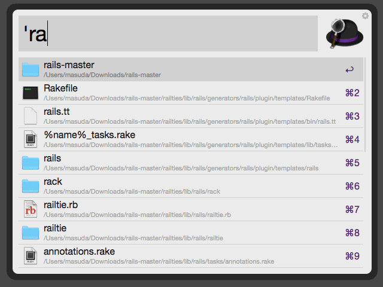

An Alfred workflow for:
- searching through one or more directory trees of a file system with a regular expression against the file name like the `find` command.
- searching for lines matching a regular expression like the `grep` command.
- opening the matching files or lines directly in the text editor such as MacVim, Emacs, Sublime Text, and TextMate

## Requirements
- [Alfred 2](http://www.alfredapp.com/#download)
- [Alfred Powerpack](https://buy.alfredapp.com/)
- OS X Mavericks or higher (Ruby 1.9.3 or higher)
- Any text editor which allows the external program to open a file and go to a specific line

## Usage
### Getting started
In Alfred's File Actions, select `grep` to specify where the workflow searches for files in.

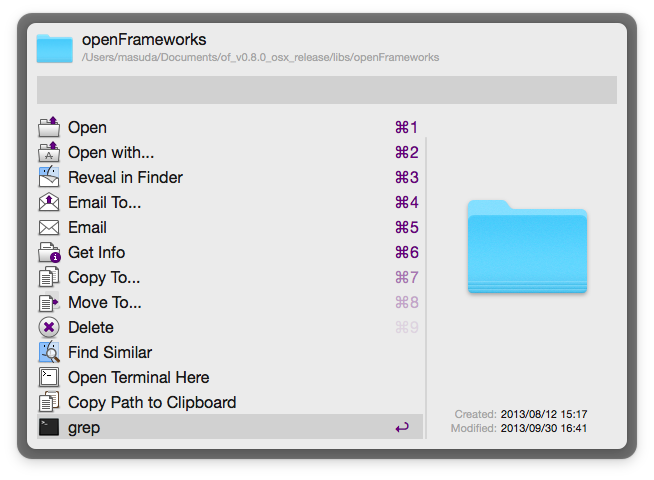

The contents of the directory are listed when the query is empty.

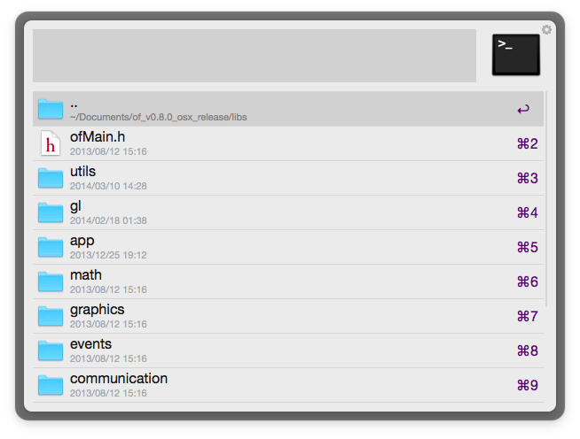

You can search for names of files as well as lines of files with a pattern.

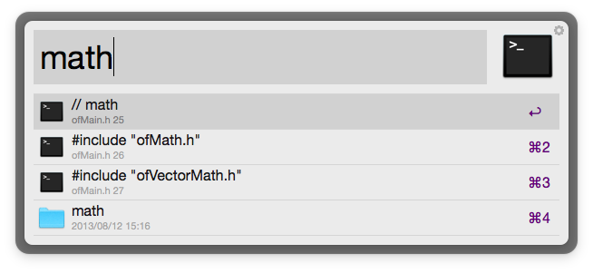

Whitespace-separated multiple patterns are treated as AND search.

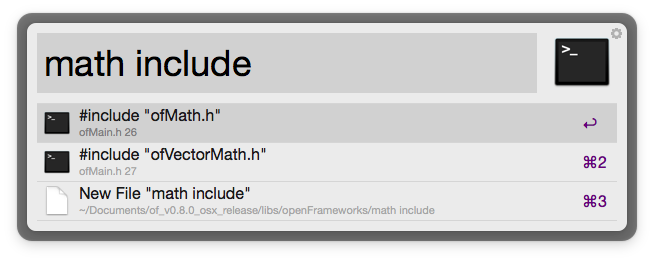

To open the results with your text editor, just select it.

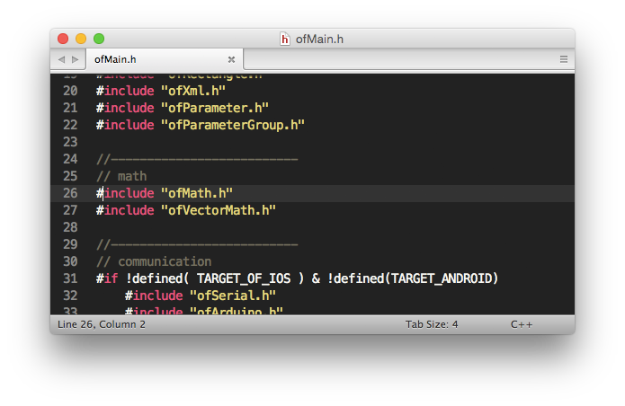

By default, Sublime Text will be launched.  To change the default application, edit `settings.json` in the workflow directory.

---

### List only directories
The `--d` flag means selecting only directories.

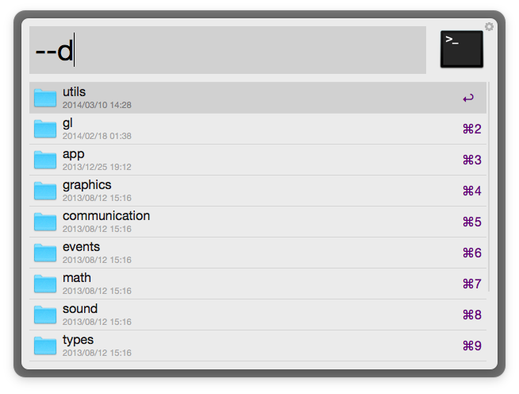

A string starting with `--` will be treated as the search options. You can write it everywhere in the query.

---

### List only files
The `--f` flag means selecting only files.

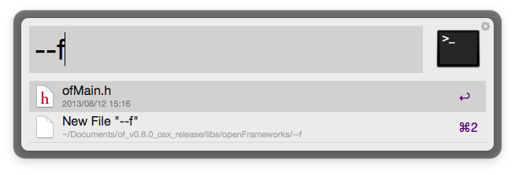

---

### List files recursively
The `--r` flag means searching subdirectories recursively.

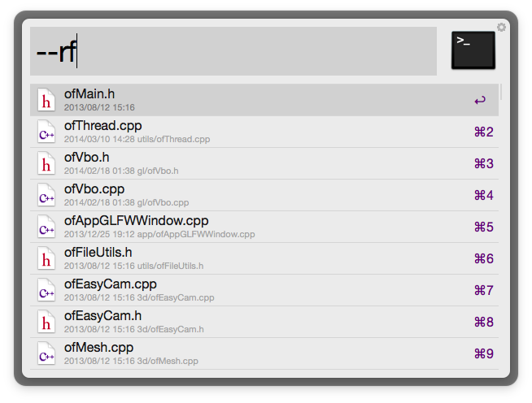

To specify multiple options, just add the character of the option without spaces. Or you can specify the options separately like `--r --f`.

---

### Selecting files by extension

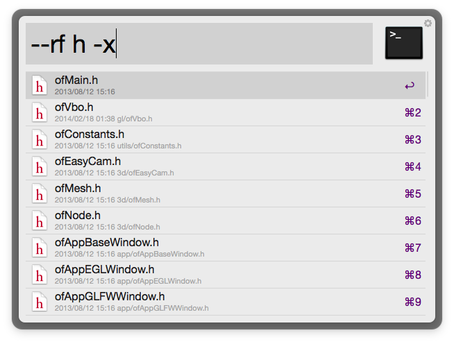

The pattern is an unquoted string like `h`, or is a regular expression literal like `/.../`. It is optionally followed by the flag which determines the search target like `-x`.

The `-x` flag means "search for file extensions with that pattern".

---

### Files containing the pattern in their path
The `-p` flag means "search for file paths with that pattern".

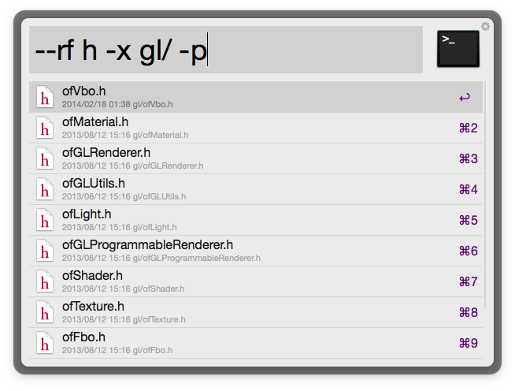

This example selects the files where their extensions contain "h" and their paths contain "gl/".

---

### Lines containing the pattern
To do `grep`, type the pattern optionally followed by the `-g` flag.

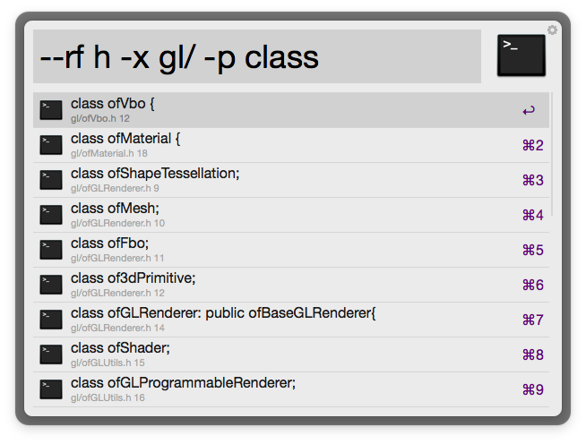

You can specify multiple search targets to one pattern. When those are omitted, the flags `-pg` meaning "search for file paths or lines with that pattern" will be used implicitly.

Note that the multiple search targets are handled as "short circuit OR". The contents of a file will not be searched if the path matches the pattern.

To search for only lines with the pattern, add an explicit `-g` flag.

---

### Using regular expression
Regular expression pattern is also available by using the `/.../` literal.

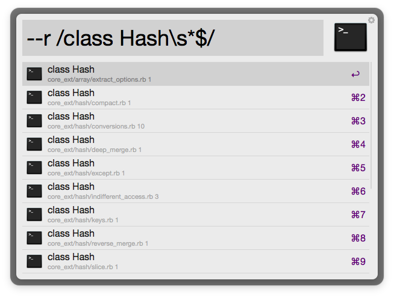

---

### Files containing the pattern in their contents
The `-c` flag means "search for file contents with that pattern".

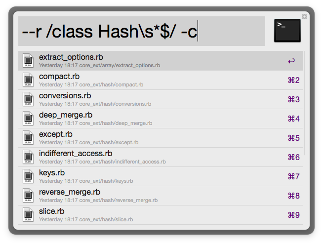

---

### Exclude pattern
The `-!` flag means "exclude pattern".

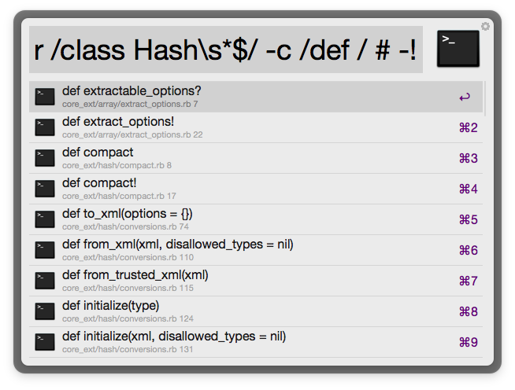

Note that `/foo/ -pg!` is expanded as `/foo/ -p! /foo/ -g!`.

---

### Hotkeys

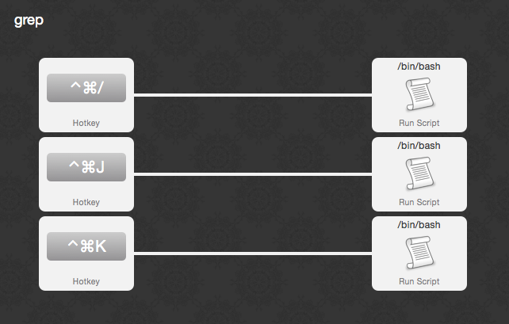

Review the workflow to add custom hotkeys. The defaults are as follows:
- `ctrl+command+/` Run the workflow with last query
- `ctrl+command+j` Find Next
- `ctrl+command+k` Find Previous

---

### Pattern flags

#### Case sensitivity `[i|I]`
- `-i` Ignore case
- `-I` Case sensitive

#### Filename matching `[p|n|b|x]`
- `-p` Search for file path like `bar/foo.txt`
- `-n` Search for file name like `foo.txt`
- `-b` Search for file basename like `foo`
- `-x` Search for file extension like `txt`

#### OpenMeta Tags matching `[t]`
- `-t` Search for file tags using [OpenMeta](https://code.google.com/p/openmeta/)

#### Full-text matching `[c|g]`
- `-c` Search for file contents
- `-g` Search for lines of files

#### Excluding `[!]`
- `-!` Exclude pattern

---

### Search options
#### Recursiveness `[r|l]`
- `--r` Search subdirectories recursively
- `--l` Non-recursive search

#### File Types `[d|f|e]`
- `--d` List directories
- `--f` List files
- `--e` List any type of files

#### File Visibility `[v|h|a]`
- `--v` List visible files
- `--h` List hidden files
- `--a` List all files

#### Sorting `[n|x|s|m][g|u]`
- `--n` Sort by file name
- `--x` Sort by file extension
- `--s` Sort by file size
- `--m` Sort by modification time
- `--g` Show direct child files of the search paths to the head of the results
- `--u` Turn off the above feature

#### Line Visibility `[A]`
- `--A` Show all lines of matching files
